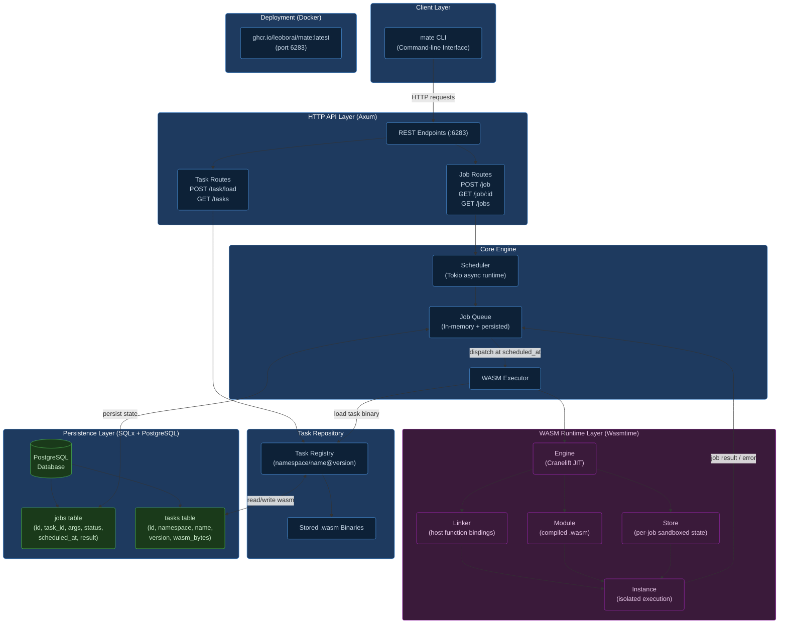

# Architecture

```mermaid
graph TB
    subgraph Client["Client Layer"]
        CLI["mate CLI\n(Command-line Interface)"]
    end

    subgraph API["HTTP API Layer (Axum)"]
        REST["REST Endpoints (:6283)"]
        JR["Job Routes\nPOST /job\nGET /job/:id\nGET /jobs"]
        TR["Task Routes\nPOST /task/load\nGET /tasks"]
        REST --> JR
        REST --> TR
    end

    subgraph Core["Core Engine"]
        SCHED["Scheduler\n(Tokio async runtime)"]
        JQ["Job Queue\n(In-memory + persisted)"]
        EXEC["WASM Executor"]
    end

    subgraph WasmRuntime["WASM Runtime Layer (Wasmtime)"]
        ENG["Engine\n(Cranelift JIT)"]
        STORE["Store\n(per-job sandboxed state)"]
        LINKER["Linker\n(host function bindings)"]
        MOD["Module\n(compiled .wasm)"]
        INST["Instance\n(isolated execution)"]
        ENG --> STORE
        ENG --> LINKER
        ENG --> MOD
        LINKER --> INST
        MOD --> INST
        STORE --> INST
    end

    subgraph TaskRepo["Task Repository"]
        TREG["Task Registry\n(namespace/name@version)"]
        WASM["Stored .wasm Binaries"]
        TREG --> WASM
    end

    subgraph Persistence["Persistence Layer (SQLx + PostgreSQL)"]
        DB[("PostgreSQL\nDatabase")]
        JOBS_T["jobs table\n(id, task_id, args, status,\nscheduled_at, result)"]
        TASKS_T["tasks table\n(id, namespace, name,\nversion, wasm_bytes)"]
        DB --> JOBS_T
        DB --> TASKS_T
    end

    subgraph Docker["Deployment (Docker)"]
        IMG["ghcr.io/leoborai/mate:latest\n(port 6283)"]
    end

    CLI -->|"HTTP requests"| REST
    JR --> SCHED
    TR --> TREG
    SCHED --> JQ
    JQ -->|"dispatch at scheduled_at"| EXEC
    EXEC -->|"load task binary"| TREG
    EXEC --> ENG
    INST -->|"job result / error"| JQ
    TREG <-->|"read/write wasm"| TASKS_T
    JQ <-->|"persist state"| JOBS_T

    classDef layer fill:#1e3a5f,stroke:#4a90d9,color:#ffffff,rx:6
    classDef component fill:#0d2137,stroke:#4a90d9,color:#c8d8e8,rx:4
    classDef db fill:#1a3a1a,stroke:#4caf50,color:#c8e8c8,rx:4
    classDef wasm fill:#3a1a3a,stroke:#9c27b0,color:#e8c8e8,rx:4
    classDef docker fill:#1a2a3a,stroke:#2196f3,color:#c8d8f8,rx:4

    class Client,API,Core,TaskRepo,Persistence,Docker layer
    class CLI,REST,JR,TR,SCHED,JQ,EXEC,TREG,WASM,IMG component
    class DB,JOBS_T,TASKS_T db
    class ENG,STORE,LINKER,MOD,INST,WasmRuntime wasm

```
